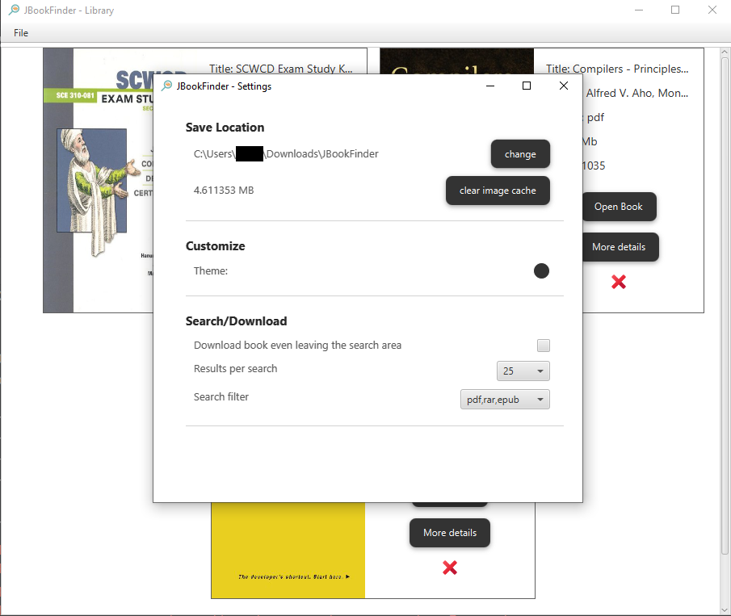

# jBookFinder

Search any book in category of science, technology and non fiction.

JBookFinder finds books these formats: 
- pdf
- epub
- rar

## Searching / Downloading

You can directly download books. JBookFinder by default saves the books in Downloads folder

## Library

Downloaded books are managed by the application, you can go to the library section and study your books:

## Settings

- If you need to change save location of book, you can go the settings and simply change it. once you have changed, books will be moved to that location.
- If you need to clear books cover which you have searched, you can clear these caches
- Also you can change theme(light/dark)
- By default when you are downloading a book, if you search another book or leave the downloading section, downloading will stop, you can change this behaviour.

